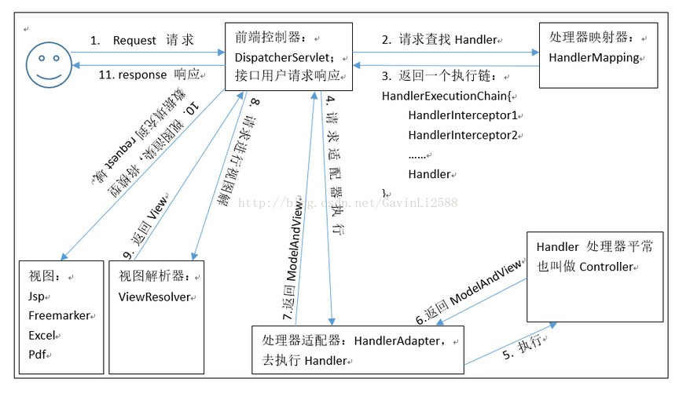

# SpringMVC

### 基本概念

* 三层架构
  * 表现层： 也就是我们常说的web层。它负责接收客户端请求，向客户端响应结果，通常客户端使用http协议请求 web 层，web 需要接收 http 请求，完成 http 响应。 表现层包括展示层和控制层：控制层负责接收请求，展示层负责结果的展示。 表现层依赖业务层，接收到客户端请求一般会调用业务层进行业务处理，并将处理结果响应给客户端。 表现层的设计一般都使用 MVC 模型。（MVC 是表现层的设计模型，和其他层没有关系） 
  * 业务层： 也就是我们常说的 service 层。它负责业务逻辑处理，和我们开发项目的需求息息相关。web 层依赖业 务层，但是业务层不依赖 web 层。 业务层在业务处理时可能会依赖持久层，如果要对数据持久化需要保证事务一致性。（也就是我们说的， 事务应该放到业务层来控制） 
  * 持久层： 也就是我们是常说的 dao 层。负责数据持久化，包括数据层即数据库和数据访问层，数据库是对数据进 行持久化的载体，数据访问层是业务层和持久层交互的接口，业务层需要通过数据访问层将数据持久化到数据库 中。通俗的讲，持久层就是和数据库交互，对数据库表进行曾删改查的。
* MVC模型
  * MVC 全名是 Model View Controller，是模型(model)－视图(view)－控制器(controller)的缩写， 是一种用于设计创建 Web 应用程序表现层的模式。
  * MVC 中每个部分各司其职： 
    * Model（模型）： 通常指的就是我们的数据模型。作用一般情况下用于封装数据。 
    * View（视图）： 通常指的就是我们的 jsp 或者 html。作用一般就是展示数据的。 通常视图是依据模型数据创建的。
    * Controller（控制器）： 是应用程序中处理用户交互的部分。作用一般就是处理程序逻辑的。 它相对于前两个不是很好理解，这里举个例子： 例如： 我们要保存一个用户的信息，该用户信息中包含了姓名，性别，年龄等等。 这时候表单输入要求年龄必须是 1~100 之间的整数。姓名和性别不能为空。并且把数据填充 到模型之中。 此时除了 js 的校验之外，服务器端也应该有数据准确性的校验，那么校验就是控制器的该做 的。 当校验失败后，由控制器负责把错误页面展示给使用者。 如果校验成功，也是控制器负责把数据填充到模型，并且调用业务层实现完整的业务需求。
* 优点
  1. 清晰的角色划分： 
     * 前端控制器（DispatcherServlet） 请求到处理器映射（HandlerMapping） 
     * 处理器适配器（HandlerAdapter） 
     * 视图解析器（ViewResolver） 处理器或页面
     * 控制器（Controller） 
     * 验证器（ Validator） 
     * 命令对象（Command 请求参数绑定到的对象就叫命令对象） 
     * 表单对象（Form Object 提供给表单展示和提交到的对象就叫表单对象）。 
  2. 分工明确，而且扩展点相当灵活，可以很容易扩展，虽然几乎不需要。 
  3. 由于命令对象就是一个 POJO，无需继承框架特定 API，可以使用命令对象直接作为业务对象。
  4. 和 Spring 其他框架无缝集成，是其它 Web 框架所不具备的。
  5. 可适配，通过 HandlerAdapter 可以支持任意的类作为处理器。
  6. 可定制性，HandlerMapping、ViewResolver 等能够非常简单的定制。
  7. 功能强大的数据验证、格式化、绑定机制。
  8. 利用 Spring 提供的 Mock 对象能够非常简单的进行 Web 层单元测试。
  9. 本地化、主题的解析的支持，使我们更容易进行国际化和主题的切换。
  10. 强大的 JSP 标签库，使 JSP 编写更容易。 ………………还有比如RESTful风格的支持、简单的文件上传、约定大于配置的契约式编程支持、基于注解的零配 置支持等等。
* 与Struts2对比
  * 共同点： 
    * 它们都是表现层框架，都是基于 MVC 模型编写的。 
    * 它们的底层都离不开原始 ServletAPI。 它们处理请求的机制都是一个核心控制器。 
  * 区别： 
    * Spring MVC 的入口是 Servlet, 而 Struts2 是 Filter Spring MVC 是基于方法设计的，而 Struts2 是基于类，Struts2 每次执行都会创建一个动作类。所 以 Spring MVC 会稍微比 Struts2 快些。 
    * Spring MVC 使用更加简洁,同时还支持 JSR303, 处理 ajax 的请求更方便 (JSR303 是一套 JavaBean 参数校验的标准，它定义了很多常用的校验注解，我们可以直接将这些注 解加在我们 JavaBean 的属性上面，就可以在需要校验的时候进行校验了。) 
    * Struts2 的 OGNL 表达式使页面的开发效率相比 Spring MVC 更高些，但执行效率并没有比 JSTL 提 升，尤其是 struts2 的表单标签，远没有 html 执行效率高。

### SpringMVC入门

* SpringMVC执行流程原理



* 组件

  * DispatcherServlet：前端控制器

    * 用户请求到达前端控制器，它就相当于 mvc 模式中的 c，dispatcherServlet 是整个流程控制的中心，由它调用其它组件处理用户的请求，dispatcherServlet 的存在降低了组件之间的耦合性。

  * HandlerMapping：处理器映射器 

    * HandlerMapping 负责根据用户请求找到 Handler 即处理器，SpringMVC 提供了不同的映射器实现不同的 映射方式，例如：配置文件方式，实现接口方式，注解方式等。

  * Handler：处理器 

    * 它就是我们开发中要编写的具体业务控制器。由 DispatcherServlet 把用户请求转发到 Handler。由 Handler 对具体的用户请求进行处理。 

  * HandlAdapter：处理器适配器 

    * 通过 HandlerAdapter 对处理器进行执行，这是适配器模式的应用，通过扩展适配器可以对更多类型的处理 器进行执行。 

  * View Resolver：视图解析器 

    * View Resolver 负责将处理结果生成 View 视图，View Resolver 首先根据逻辑视图名解析成物理视图名 即具体的页面地址，再生成 View 视图对象，最后对 View 进行渲染将处理结果通过页面展示给用户。 

  * View：视图 

    * SpringMVC 框架提供了很多的 View 视图类型的支持，包括：jstlView、freemarkerView、pdfView 等。我们最常用的视图就是 jsp。 一般情况下需要通过页面标签或页面模版技术将模型数据通过页面展示给用户，需要由程序员根据业务需求开 发具体的页面。

  * \<mvc:annotation-driven\>

    在 SpringMVC 的各个组件中，处理器映射器、处理器适配器、视图解析器称为SpringMVC 的三大组件。 使用\<mvc:annotation-driven\>自动加载RequestMappingHandlerMapping（处理映射器）和RequestMappingHandlerAdapter（ 处 理 适 配 器 ）,可 用在SpringMVC.xml配置文件中使用 \<mvc:annotation-driven\>替代注解处理器和适配器的配置。它就相当于在xml 中配置了：

    ```xml
    <mvc:annotation-driven/>
    <!-- 相当于 如下配置-->
    <!-- Begin -->
    <!-- HandlerMapping -->
    <bean class="org.springframework.web.servlet.mvc.method.annotation.RequestMappingHandlerMapping"/>
    <bean
    class="org.springframework.web.servlet.handler.BeanNameUrlHandlerMapping"/>
    <!-- HandlerAdapter -->
    <bean
    class="org.springframework.web.servlet.mvc.method.annotation.RequestMappingHandlerAdapter"/>
    <bean
    class="org.springframework.web.servlet.mvc.HttpRequestHandlerAdapter"/>
    <bean
    class="org.springframework.web.servlet.mvc.SimpleControllerHandlerAdapter"/>
    <!-- HadnlerExceptionResolvers -->
    <bean
    class="org.springframework.web.servlet.mvc.method.annotation.ExceptionHandlerExceptionResolver"/>>
    <bean
    class="org.springframework.web.servlet.mvc.annotation.ResponseStatusExceptionResolver"/>
    <bean
    class="org.springframework.web.servlet.mvc.support.DefaultHandlerExceptionResolver"/>
    <!-- End -->
    ```

* RequestMapping注解

  * 作用： 用于建立请求 URL 和处理请求方法之间的对应关系。

  * 出现位置： 

    * 类上： 请求 URL 的第一级访问目录。此处不写的话，就相当于应用的根目录。写的话需要以/开头。 它出现的目的是为了使我们的 URL 可以按照模块化管理: 

      例如

      账户模块： 

      /account/add 

      /account/update 

      /account/delete ... 

      订单模块： 

      /order/add 

      /order/update 

      /order/delete 

      前面的部分就是把 RequsetMappding 写在类上，使我们的 URL 更加精细。 

    * 方法上： 请求 URL 的第二级访问目录。 

  * 属性： 

    * value：用于指定请求的 URL。它和 path 属性的作用是一样的。 

    * method：用于指定请求的方式。 

    * params：用于指定限制请求参数的条件。它支持简单的表达式。要求请求参数的 key 和 value 必须和 配置的一模一样。 

      例如： 

      params = {"accountName"}，表示请求参数必须有 accountName 

      params = {"moeny!100"}，表示请求参数中 money 不能是 100。 

    * headers：用于指定限制请求消息头的条件。

* 流程小结

  1. 创建工程，导入坐标 
  2. 在web.xml中配置前端控制器（启动服务器，加载springmvc.xml配置文件） 
  3. 编写springmvc.xml配置文件 
  4. 编写index.jsp的页面，发送请求
  5.  编写Controller类，编写方法（@RequestMapping(path="/hello")），处理请求
  6. 编写配置文件（开启注解扫描），配置视图解析器 
  7. 执行的流程
  8. @RequestMapping注解

### 请求参数的绑定

*  请求参数的绑定说明 

  * 绑定机制 

    1. 表单提交的数据都是k=v格式的 username=haha&password=123 
    2. SpringMVC的参数绑定过程是把表单提交的请求参数，作为控制器中方法的参数进行绑定的
    3. 要求：提交表单的name和参数的名称是相同的 

  * 支持的数据类型 

    1. 基本数据类型和字符串类型 

       * 提交表单的name和参数的名称是相同的
       * 区分大小写 

    2. 实体类型（JavaBean）

       * 提交表单的name和JavaBean中的属性名称需要一致

       * 如果一个JavaBean类中包含其他的引用类型，那么表单的name属性需要编写成：对象.属性 

         例如： address.name 

    3. 集合数据类型（List、map集合等） 

    4. 给集合属性数据封装

       * JSP页面编写方式：list[0].属性

  * 请求参数中文乱码的解决 

    * 在web.xml中配置Spring提供的过滤器类

      ```xml
      <!--配置解决中文乱码的过滤器-->
        <filter>
          <filter-name>characterEncodingFilter</filter-name>
          <filter-class>org.springframework.web.filter.CharacterEncodingFilter</filter-class>
          <init-param>
            <param-name>encoding</param-name>
            <param-value>UTF-8</param-value>
          </init-param>
        </filter>
        <filter-mapping>
            <filter-name>characterEncodingFilter</filter-name>
            <url-pattern>/*</url-pattern>
        </filter-mapping>
      ```

  * 自定义类型转换器 

    * 表单提交的任何数据类型全部都是字符串类型，但是后台定义Integer类型，数据也可以封装上，说明 Spring框架内部会默认进行数据类型转换。 

    * 如果想自定义数据类型转换，可以实现Converter的接口 

      1. 自定义类型转换器

      2.  注册自定义类型转换器，在springmvc.xml配置文件中编写配置

         ```xml
         <!--配置自定义类型转换器-->
             <bean id="conversionService" class="org.springframework.context.support.ConversionServiceFactoryBean">
                 <property name="converters">
                     <set>
                         <bean class="cn.itcast.utils.StringToDateConverter"/>
                     </set>
                 </property>
             </bean>
         ```

### 常用的注解

#### RequestParam注解 

```java
@RequestMapping(path="/hello")
public String sayHello(@RequestParam(value="username",required=false)String name) {
    System.out.println("aaaa");
    System.out.println(name);
    return "success";
}
```

* 作用：把请求中的指定名称的参数传递给控制器中的形参赋值 
*  属性 
  * value：请求参数中的名称
  * required：请求参数中是否必须提供此参数，默认值是true，必须提供

#### RequestBody注解 

```java
@RequestMapping("/testRequestBody")
public String testRequestBody(@RequestBody String body){
    System.out.println("执行了...");
    System.out.println(body);
    return "success";
}
```

* 作用：用于获取请求体的内容（注意：get方法不可以） 
* 属性
  * required：是否必须有请求体，默认值是true

#### PathVariable注解 

```java
@RequestMapping(value="/testPathVariable/{sid}")
public String testPathVariable(@PathVariable(name="sid") String id){
    System.out.println("执行了...");
    System.out.println(id);
    return "success";
}
```

* 作用：拥有绑定url中的占位符的。例如：url中有/delete/{id}，{id}就是占位符 

* 属性 

  * value：指定url中的占位符名称 

* Restful风格的URL 

  请求路径一样，可以根据不同的请求方式去执行后台的不同方法 

  restful风格的URL优点 

  * 结构清晰 
  * 符合标准 
  * 易于理解 
  * 扩展方便

#### RequestHeader注解

```java
@RequestMapping(value="/testRequestHeader")
public String testRequestHeader(@RequestHeader(value="Accept") String header, HttpServletRequest request,HttpServletResponse response) throws IOException {
    System.out.println("执行了...");
    System.out.println(header);
    // return "success";
    // response.sendRedirect(request.getContextPath()+"/anno/testCookieValue");
    return "redirect:/param.jsp";
}
```

* 作用：获取指定请求头的值
* 属性 
  * value：请求头的名称

#### CookieValue注解

```java
@RequestMapping(path="/hello")
public String sayHello(@CookieValue(value="JSESSIONID") String cookieValue) {
    System.out.println(cookieValue);
    return "success";
}
```

* 作用：用于获取指定cookie的名称的值 
* 属性 
  * value：cookie的名称

#### ModelAttribute注解 

* 作用 

  * 出现在方法上：表示当前方法会在控制器方法执行前线执行。 
  * 出现在参数上：获取指定的数据给参数赋值。 

* 应用场景 

  * 当提交表单数据不是完整的实体数据时，保证没有提交的字段使用数据库原来的数据。

* 案例

  *  修饰的方法有返回值

    ```java
    @ModelAttribute
    public User showUser(String name) {
        System.out.println("showUser执行了...");
        // 模拟从数据库中查询对象
        User user = new User();
        user.setName("哈哈");
        user.setPassword("123");
        user.setMoney(100d);
        return user;
    }
    
    @RequestMapping(path="/updateUser")
    public String updateUser(User user) {
        System.out.println(user);
        return "success";
    }
    
    ```

  *  修饰的方法无返回值

    ```java
    @ModelAttribute
    public void showUser(String name,Map<String, User> map) {
        System.out.println("showUser执行了...");
        // 模拟从数据库中查询对象
        User user = new User();
        user.setName("哈哈");
        user.setPassword("123");
        user.setMoney(100d);
        map.put("abc", user);
    }
    @RequestMapping(path="/updateUser")
    public String updateUser(@ModelAttribute(value="abc") User user) {
        System.out.println(user);
        return "success";
    }
    ```

#### SessionAttributes注解 

```java
@RequestMapping(value="/testSessionAttributes")
public String testSessionAttributes(Model model){
    System.out.println("testSessionAttributes...");
    // 底层会存储到request域对象中
    model.addAttribute("msg","美美");
    return "success";
}

@RequestMapping(value="/getSessionAttributes")
public String getSessionAttributes(ModelMap modelMap){
    System.out.println("getSessionAttributes...");
    String msg = (String) modelMap.get("msg");
    System.out.println(msg);
    return "success";
}

@RequestMapping(value="/delSessionAttributes")
public String delSessionAttributes(SessionStatus status){
    System.out.println("getSessionAttributes...");
    status.setComplete();
    return "success";
}
```

* 作用：用于多次执行控制器方法间的参数共享 
* 属性 
  * value：指定存入属性的名称

### 响应数据和结果视图

#### 返回值分类

* 返回字符串

  *  Controller方法返回字符串可以指定逻辑视图的名称，根据视图解析器为物理视图的地址

    ```java
    @RequestMapping(value="/hello")
    public String sayHello() {
        System.out.println("Hello SpringMVC!!");
        // 跳转到XX页面
        return "success";
    }
    ```

  * 应用

    ```java
    @Controller
    @RequestMapping("/user")
    public class UserController {
        /**
        * 请求参数的绑定
        */
        @RequestMapping(value="/initUpdate")
        public String initUpdate(Model model) {
            // 模拟从数据库中查询的数据
            User user = new User();
            user.setUsername("张三");
            user.setPassword("123");
            user.setMoney(100d);
            user.setBirthday(new Date());
            model.addAttribute("user", user);
            return "update";
        }
    }
    ```

    ```jsp
    <h3>执行成功</h3>
        ${user.username}
        ${user.password}
        ${user.age}
    ```

*  返回值是void 

  * 如果控制器的方法返回值编写成void，执行程序报404的异常，默认查找JSP页面没有找到。

    默认会跳转到@RequestMapping(value="/initUpdate") initUpdate的页面。 

  * 可以使用请求转发或者重定向跳转到指定的页面

    ```java
    @RequestMapping("/testVoid")
    public void testVoid(HttpServletRequest request, HttpServletResponse response) throws Exception {
        System.out.println("testVoid方法执行了...");
        // 编写请求转发的程序
        // request.getRequestDispatcher("/WEB-INF/pages/success.jsp").forward(request,response);
    
        // 重定向
        // response.sendRedirect(request.getContextPath()+"/index.jsp");
    
        // 设置中文乱码
        response.setCharacterEncoding("UTF-8");
        response.setContentType("text/html;charset=UTF-8");
    
        // 直接会进行响应
        response.getWriter().print("你好");
    
        return;
    }
    ```

* 返回值是ModelAndView对象 

  * ModelAndView对象是Spring提供的一个对象，可以用来调整具体的JSP视图

  * 应用

    ```java
    @RequestMapping("/testModelAndView")
    public ModelAndView testModelAndView(){
        // 创建ModelAndView对象
        ModelAndView mv = new ModelAndView();
        System.out.println("testModelAndView方法执行了...");
        // 模拟从数据库中查询出User对象
        User user = new User();
        user.setUsername("小凤");
        user.setPassword("456");
        user.setAge(30);
    
        // 把user对象存储到mv对象中，也会把user对象存入到request对象
        mv.addObject("user",user);
    
        // 跳转到哪个页面，过程中会使用视图解析器
        mv.setViewName("success");
    
        return mv;
    }
    ```

#### SpringMVC框架提供的转发和重定向

* forward请求转发 

  * 进行请求转发

    ```java
    @RequestMapping("/testForwardOrRedirect")
    public String testForwardOrRedirect(){
        System.out.println("testForwardOrRedirect方法执行了...");
        return "forward:/WEB-INF/pages/success.jsp";
    }
    ```

* redirect重定向

  *  进行重定向

    ```java
    @RequestMapping("/testForwardOrRedirect")
    public String count() throws Exception {
        System.out.println("testForwardOrRedirect方法执行了...");
        return "redirect:/index.jsp";
    }
    ```

* ResponseBody响应json数据

  * DispatcherServlet会拦截到所有的资源，导致一个问题就是静态资源（img、css、js）也会被拦截到，从而 不能被使用。

    解决方式就是需要配置静态资源不进行拦截，在springmvc.xml配置文件添加mvc:resources标签配置不过滤 

    1. location元素表示webapp目录下的包下的所有文件 

    2. mapping元素表示以/static开头的所有请求路径，如/static/a 或者/static/a/b

       ```jsp
       <!-- 设置静态资源不过滤 -->
       <mvc:resources location="/css/" mapping="/css/**"/> <!-- 样式 -->
       <mvc:resources location="/images/" mapping="/images/**"/> <!-- 图片 -->
       <mvc:resources location="/js/" mapping="/js/**"/> <!-- javascript -->
       ```

  * 使用@RequestBody获取请求体数据

    ```jsp
    <script>
    // 页面加载，绑定单击事件
        $(function(){
            $("#btn").click(function(){
                // alert("hello btn");
                // 发送ajax请求
                $.ajax({
                    // 编写json格式，设置属性和值
                    url:"user/testAjax",
                    contentType:"application/json;charset=UTF-8",
                    data:'{"username":"hehe","password":"123","age":30}',
                    dataType:"json",
                    type:"post",
                    success:function(data){
                        // data服务器端响应的json的数据，进行解析
                        alert(data);
                    }
                });
    
            });
        });
    </script>
    ```

    ```java
    @RequestMapping("/testJson")
    public void testJson(@RequestBody String body) {
    	System.out.println(body);
    }
    ```

  * 使用@RequestBody注解把json的字符串转换成JavaBean的对象

  * 使用@ResponseBody注解把JavaBean对象转换成json字符串，直接响应

    要求方法需要返回JavaBean的对象

    ```jsp
    <script>
    // 页面加载，绑定单击事件
        $(function(){
            $("#btn").click(function(){
                // alert("hello btn");
                // 发送ajax请求
                $.ajax({
                    // 编写json格式，设置属性和值
                    url:"user/testAjax",
                    contentType:"application/json;charset=UTF-8",
                    data:'{"username":"hehe","password":"123","age":30}',
                    dataType:"json",
                    type:"post",
                    success:function(data){
                        // data服务器端响应的json的数据，进行解析
                        alert(data);
                        alert(data.username);
                        alert(data.password);
                        alert(data.age);
                    }
                });
    
            });
        });
    </script>
    ```

    ```java
    @RequestMapping("/testAjax")
    public @ResponseBody User testAjax(@RequestBody User user){
        System.out.println("testAjax方法执行了...");
        // 客户端发送ajax的请求，传的是json字符串，后端把json字符串封装到user对象中
        System.out.println(user);
        // 做响应，模拟查询数据库
        user.setUsername("haha");
        user.setAge(40);
        // 做响应
        return user;
    }
    ```

### SpringMVC实现文件上传

