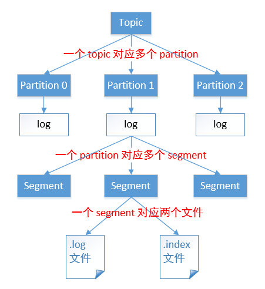

# Kafka

## 1.概述

### 定义

> Kafka 是一个分布式的基于发布/订阅模式的消息队列（Message Queue），主要应用于 大数据实时处理领域

### 消息队列

* 应用于异步请求处理

* 优势

  * 解耦
    * 允许你独立的扩展或修改两边的处理过程，只要确保它们遵守同样的接口约束
  * 可恢复性
    * 系统的一部分组件失效时，不会影响到整个系统。消息队列降低了进程间的耦合度，所以即使一个处理消息的进程挂掉，加入队列中的消息仍然可以在系统恢复后被处理
  * 缓冲
    * 有助于控制和优化数据流经过系统的速度，解决生产消息和消费消息的处理速度不一致 的情况
  * 灵活性 & 峰值处理能力
    * 在访问量剧增的情况下，应用仍然需要继续发挥作用，但是这样的突发流量并不常见。 如果为以能处理这类峰值访问为标准来投入资源随时待命无疑是巨大的浪费。使用消息队列 能够使关键组件顶住突发的访问压力，而不会因为突发的超负荷的请求而完全崩溃
  * 异步通信
    * 很多时候，用户不想也不需要立即处理消息。消息队列提供了异步处理机制，允许用户 把一个消息放入队列，但并不立即处理它。想向队列中放入多少消息就放多少，然后在需要 的时候再去处理它们。

* 消息队列的两种模式

  * 点对点模式（一对一，消费者主动拉取数据，消息收到后消息清除）

    消息生产者生产消息发送到Queue中，然后消息消费者从Queue中取出并且消费消息。 消息被消费以后，queue 中不再有存储，所以消息消费者不可能消费到已经被消费的消息。 Queue 支持存在多个消费者，但是对一个消息而言，只会有一个消费者可以消费

  * 发布/订阅模式（一对多，消费者消费数据之后不会清除消息）

    消息生产者（发布）将消息发布到 topic 中，同时有多个消息消费者（订阅）消费该消 息。和点对点方式不同，发布到 topic 的消息会被所有订阅者消费

### Kafka基础架构

* 三层架构

  第一层是主题层，每个主题可以配置 M 个分区，而每个分区又可以配置 N 个副本

  第二层是分区层，每个分区的 N 个副本中只能有一个充当领导者角色，对外提供服务；其他 N-1 个副本是追随者副本，只是提供数据冗余之用
  
  第三层是消息层，分区中包含若干条消息，每条消息的位移从 0 开始，依次递增。 最后，客户端程序只能与分区的领导者副本进行交互


* Producer ：消息生产者，就是向 kafka broker 发消息的客户端

* Consumer ：消息消费者，向 kafka broker 取消息的客户端

* Consumer Group（CG）：消费者组，由多个 consumer 组成。消费者组内每个消费者负 责消费不同分区的数据，一个分区只能由一个组内消费者消费；消费者组之间互不影响。所有的消费者都属于某个消费者组，即消费者组是逻辑上的一个订阅者

* Broker ：一台 kafka 服务器就是一个 broker。一个集群由多个 broker 组成。一个 broker 可以容纳多个 topic

* Topic ：可以理解为一个队列，生产者和消费者面向的都是一个topic

* Partition：为了实现扩展性，一个非常大的 topic 可以分布到多个 broker（即服务器）上， 一个 topic 可以分为多个 partition，每个 partition 是一个有序的队列

* Replica：副本，为保证集群中的某个节点发生故障时，该节点上的 partition 数据不丢失

* Broker端配置

  | 配置名                         | 含义                                              |
  | ------------------------------ | ------------------------------------------------- |
  | log.dirs                       | 指定了 Broker 需要使用的若干个文件目录路径        |
  | zookeeper.connect              | 与zookeeper连接                                   |
  | listeners                      | 通过什么协议访问指定主机名和端口开放的 Kafka 服务 |
  | advertised.listeners           | Broker 用于对外发布的监听器                       |
  | auto.create.topics.enable      | 是否允许自动创建 Topic                            |
  | unclean.leader.election.enable | 是否允许 Unclean Leader 选举                      |
  | auto.leader.rebalance.enable   | 是否允许定期进行 Leader 选举                      |
  | retention.ms                   | 规定了该 Topic 消息被保存的时长                   |
  | retention.bytes                | 规定了要为该 Topic 预留多大的磁盘空间             |

### 工作流程

#### 文件存储

* index,log文件

  

  一个分区生成index,log各一个，index记录消息索引、偏移量以及大小

  二分查找索引，获取索引信息获取对应的消息内容

  由于生产者生产的消息会不断追加到 log 文件末尾，为防止 log 文件过大导致数据定位效率低下，Kafka 采取了**分片**和**索引**机制，将每个 partition 分为多个 segment，每个 segment 对应两个文件：“.index” 索引文件和 “.log” 数据文件。这些文件位于同一文件下，该文件夹的命名规则为：topic 名-分区号。例如，first 这个 topic 有三分分区，则其对应的文件夹为 first-0，first-1，first-2。

#### Kafka生产者

* 分区策略

  为提高并发、方便在集群中扩展进行分区

  - topic：string 类型，NotNull
  - partition：int 类型，可选
  - timestamp：long 类型，可选
  - key：string类型，可选
  - value：string 类型，可选
  - headers：array 类型，Nullable

* 生产者

  producer封装数据封装成一个ProducerRecord对象

  1. 指定partition时，直接按指定

  2. 没有指定但包含key，则按key的hash与topic的partition数取余的值

  3. 均未指定则第一次调用随机生成值，将值按topic的partition总数取余

     轮询调度算法的原理是每一次把来自用户的请求轮流分配给内部中的服务器，从1开始，直到N(内部服务器个数)，然后重新开始循环。算法的优点是其简洁性，它无需记录当前所有连接的状态，所以它是一种无状态调度。

  数据可靠性保证

  为保证producer发送的数据即可靠的发送到指定的topic，topic的每个partition收到producer发送的数据后，都需要向producer发送ack确认收到，如果producer收到ack，就会进行下一轮的发送，否则重发数据

  1. 副本同步策略

     * 半数加一的数量完成同步，就发送ack

       延迟低，n个副本选举leader容许n/2台节点故障

     * 全部完成同步，才发送ack

       延迟高，选举新leader只要有一台未故障即可

  2. ISR

     leader维护了一个动态的 in-sync replica set：和 leader 保持同步的 follower 集合。当 ISR 集合中的 follower 完成数据的同步之后，leader 就会给 follower 发送 ack。如果 follower 长时间未向 leader 同步数据，则该 follower 将被踢出 ISR 集合，该时间阈值由 replica.lag.time.max.ms 参数设定。leader 发生故障后，就会从 ISR 中选举出新的 leader

  3. ACK应答机制

     对于某些不太重要的数据，对数据的可靠性要求不是很高，能够容忍数据的少量丢失，所以没必要等 ISR 中的 follower 全部接受成功。
     Kafka 为用户提供了三种可靠性级别，用户根据可靠性和延迟的要求进行权衡，选择以下配置

     - 0表示producer 不等待 broker 的 ack，这提供了最低延迟，broker 一收到数据还没有写入磁盘就已经返回，当 broker 故障时有可能丢失数据
     - 1表示producer 等待 broker 的 ack，partition 的 leader 落盘成功后返回 ack，如果在 follower 同步成功之前 leader 故障，那么将会丢失数据
     - -1表示producer 等待 broker 的 ack，partition 的 leader 和 follower 全部落盘成功后才返回 ack。但是在 broker 发送 ack 时，leader 发生故障，则会造成数据重复

  4. 故障细节处理

     LEO：每个副本最大的 offset。
     HW：消费者能见到的最大的 offset，ISR 队列中最小的 LEO。

     * Follower 故障
       follower 发生故障后会被临时踢出 ISR 集合，待该 follower 恢复后，follower 会 读取本地磁盘记录的上次的 HW，并将 log 文件高于 HW 的部分截取掉，从 HW 开始向 leader 进行同步数据操作。等该 follower 的 LEO 大于等于该 partition 的 HW，即 follower 追上 leader 后，就可以重新加入 ISR 了。
     * Leader 故障
       leader 发生故障后，会从 ISR 中选出一个新的 leader，之后，为保证多个副本之间的数据一致性，其余的 follower 会先将各自的 log 文件高于 HW 的部分截掉，然后从新的 leader 同步数据。
       注意：这只能保证副本之间的数据一致性，并不能保证数据不丢失或者不重复。

  5. Exactly One

     将服务器的 ACK 级别设置为-1，可以保证 producer 到 server 之间不会丢失数据，即 **At Least Once** 语义。相对的，将服务器 ACK 级别设置为0，可以保证生产者每条消息只会被发送一次，即**At Most Once** 语义。
     At Least Once 可以保证数据不丢失，但是不能保证数据不重复；相对的，At Most Once 可以保证数据不重复，但是不能保证数据不丢失。但是，对于一些非常重要的信息，比如交易数据，下游数据消费者要求数据既不重复也不丢失，即 **Exactly Once** 语义。
     0.11版本的 Kafka，引入了**幂等性**：producer 不论向 server 发送多少重复数据，server 端都只会持久化一条。即：

     ```
     At Least Once + 幂等性 = Exactly Once
     ```

     要启用幂等性，只需要将 producer 的参数中 enable.idompotence 设置为 true 即可。开启幂等性的 producer 在初始化时会被分配一个 PID，发往同一 partition 的消息会附带 Sequence Number。而 borker 端会对 <PID,Partition,SeqNumber> 做缓存，当具有相同主键的消息提交时，broker 只会持久化一条。
     但是 PID 重启后就会变化，同时不同的 partition 也具有不同主键，所以幂等性无法保证跨分区会话的 Exactly Once


### 消费者

* 消费方式

  consumer 采用 pull（拉）模式从 broker 中读取数据。 
  push模式很难适应消费速率不同的消费者，因为消息发送速率是由 broker 决定的。
  它的目标是尽可能以最快速度传递消息，但是这样很容易造成 consumer 来不及处理消息，典型的表现就是拒绝服务以及网络拥塞。而 pull 模式则可以根据 consumer 的消费能力以适当的速率消费消息。 
  pull 模式不足之处是，如果 kafka 没有数据，消费者可能会陷入循环中，一直返回空数据。针对这一点，Kafka 的消费者在消费数据时会传入一个时长参数 timeout，如果当前没有数据可供消费，consumer 会等待一段时间之后再返回，这段时长即为 timeout

* 分区分配策略

  确定那个 partition 由哪个 consumer 来消费，Kafka 有两种分配策略，一是 RoundRobin，一是 Range

  RoundRobin轮询按照组来消费

  * 优点

    就是一个消费者组多个消费者直接消费消息最多相差1个

  * 缺点

    使用轮询的策略有一个问题，当一个消费者组订阅的是多个topic主题，假设有一个消费者组（consumerA订阅了主题topic1和consumerB主题topic2）consumerA消费topic1，consumerB消费topic2 ，这看起来似乎没有问题，使用轮询的策略会将消费者组订阅的主题当成一个整体。但是topic1和topic2各有三个partition分区，在kafka内部有一个TopicAndPartition这个类会将topic1和topic2的partition进行排序，假设两个经过排序之后顺序{topic1partition0，topic2partition0，topic2partition1，topic1partition2，topic1partition1，topic2partition2}   然后consumerA和consumerB轮询的拉去消息，这样consumerA就会将topic2的消息给拉取消费了这样是不是有问题？

  * 所以使用轮询策略条件的前提：就是一个消费者组里消费者订阅的主题是一样的，只有consumerA和consumerB都订阅了topic1和topic2，这样使用轮询的方式才不会有问题

  Range按照主题的方式消费

  * 范围range是按照范主题划分的，一个主题7个分区 3个消费者  7除以3除不尽就会分布不均，消费者1消费前topic1的前三个分区，后面两个消费者消费topic1的4和5分区   6和7分区就给消费者3消费，这种情况看起来也没有什么问题？

    缺点：假设消费者他们订阅了2个主题topic1和topic2  都是7个分区 ，由于是按主题划分的所以，消费者1就分到了topic1和topic2的1、2、3分区这样消费者1就被分到了6个分区，消费者2和消费者3只分到了4个分区，随着订阅的主题越来越多，这样消费者1和其他消费者相差越来越大，就不均衡了 

    思考一个问题:消费者消费消息什么时候重新分配？

    当消费者个数发生变的时候，

    1，假设topic1有6个分区  三个消费者A、B、C，不管用什么策略分配，假设C负责消费partition4和partition5，突然C挂掉了，这个时候partition4和partition5需不需要消费，答案当然是要，那怎么消费？当然是重新分配

    2，假设topic1有6个分区  三个消费者A、B、C、D，当消费者A服务起来的时候6个分区都分配给了A，当B起来的时候重新分配，当C起来时候也会重新分配，消费者A、B、C都分配到了2个partition，当第四个消费者D加进来的时候，会怎么办？还是上面那句话，消费者个数发生变化的时候，就会触发分区分配策略重新分配

    总结：当消费者个数发生变的时候，消费者个数可以增多或者减少，甚至可以增多至比分区数还多的时候，照样会重新分配，只是有些消费者可能被分配不到

* 