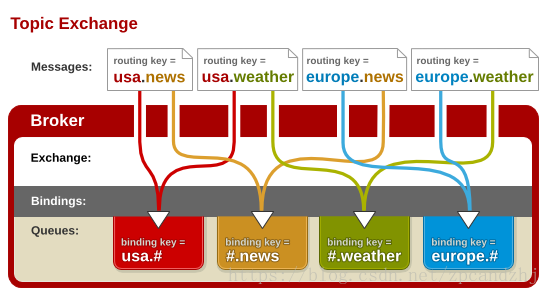

# RabbitMQ

## 概述

### 1.解决的问题

* 异步处理
* 应用解耦
* 流量削峰

### 2.五种工作队列

#### 简单队列

单一的生产者和消费者相对应

#### 工作队列

生产者对应多个消费者，一个消息只能被一个消费者获取

#### 发布订阅

#### 路由模式

将消息发送给交换机，交换机通过路由key将消息分发到对应的消息队列之中

#### 主题模式

将路由键和某模式进行匹配，符号#匹配一个或多个词，符号*仅匹配一个词，

