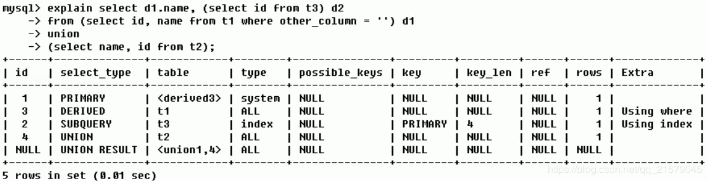

# MySQL进阶

笔记主要来自https://www.cnblogs.com/lyjun/p/11371851.html,原课程来自Bilibili

完整的mysql优化需要很深的功底，大公司甚至有专门的DBA写上述

- mysql内核
- sql优化工程师
- mysql服务器的优化
- 各种参数常量设定
- 查询语句优化
- 主从复制
- 软硬件升级
- 容灾备份
- sql编程

### mysqL-Linux版的安装

- mysql5.5

  - 下载地址：https://dev.mysql.com/downloads/mysql/5.5.html#downloads
  - 检查当前系统是否安装过mysql：
    - 查询命令：rpm -qa|grep -i mysql
    - 删除命令：rpm -e RPM软件包名称
      - 删除自带的mysql：yum -y remove mysql-libs-5.1.73-7.el6.x86_64

- 安装mysql服务端（注意提示）：

  - rpm -ivh MySQL-server-5.5.48-1.linux2.6.i386.rpm
    - 如果报错libc.so.6：https://blog.csdn.net/xiyuliuyang/article/details/90750049
    - 如果警告key ID 5072e1f5: NOKEY：https://blog.csdn.net/Aaron960214/article/details/78451321

- 安装mysql客户端

  - rpm -ivh MySQL-client-5.5.48-1.linux2.6.i386.rpm

- 查看MySQL安装时创建的mysql用户和mysql组

  - cat /etc/passwd|grep mysql
    - cat /etc/group|grep mysql
    - mysqladmin --version

- mysql服务的启+停

  - service mysql start

  - service mysql start

    - 如果报错ERROR! The server quit without updating PID file (/var/lib/mysql/localhost.localdomain.pid).

    - 解决办法：https://www.cnblogs.com/bingco/p/8068243.html

      ```
      mysql_install_db --datadir=/var/lib/mysql
      chown mysql:mysql /var/lib/mysql -R
      ```

  - 查看mysql的进程：ps -ef|grep mysql

- mysql服务启动后，开始连接

  - 首次连接成功：mysql（不需要输入密码）
    - 给root用户设置密码：/usr/bin/mysqladmin -u root password 123456

- 自启动mysql服务

  - 设置开机自启动mysql：chkconfig mysql on
    - 查看mysql的等级：chkconfig --list | grep mysql
    - 查看不同等级代表的含义：cat /etc/inittab
    - 查看开机自动服务有哪些：ntsysv

- 修改配置文件位置

  - 版本5.5：cp /usr/share/mysql/my-huge.cnf/etc/my.cnf

    - 版本5.6：cp /usr/share/mysql/**my-default.cnf** /etc/my.cnf

- 修改字符集和数据存储路径

  - 查看字符集
    - show variables like ‘character%’;
    - show variables like ‘%char%’;
    - 由于默认的是客户端和服务器都使用的latin1，所以都是乱码
    - 修改
    - 重启mysql
    - 重新连接后，原来的库由于建立于修改字符集之前，所以中文依然是乱码，而新建表中文不是乱码

* MySQL的安装位置
  * /var/lib/mysql：mysql数据库文件的存放路径
  * /usr/share/mysql：配置文件目录
  * /usr/bin：相关命令目录
  * /etc/init.d/mysql：启停相关脚本

### mysql配置文件

- 主要配置文件
  - 二进制日志log-bin
    - 主从复制
  - 错误日志log-error
    - 默认是关闭的，记录严重的警告和错误信息，每次启动和关闭的详细信息等。
  - 查询日志log
    - 默认关闭，记录查询的sql语句，如果开启会降低mysql的整体性能，因为记录日志也是需要消耗系统资源的。
  - 数据文件
    - 两系统
      - windows：D:\devSoft\MySQLServer5.5\data目录下可以挑选很多库
      - linux
        - 看看当前系统中的全部库后再进去
        - 默认路径：/var/lib/mysql
    - frm文件：存放表结构
    - myd文件：存放表数据
    - myi文件：存放表索引
  - 如何配置
    - windows：my.ini文件
    - Linux：/etc/my.cnf文件

## mysql逻辑架构介绍

- 和其它数据库相比，MySQL有点与众不同，它的架构可以在多种不同场景中应用并发挥良好作用。主要体现在存储引擎的架构上，**插件式的存储引擎架构将查询处理和其它的系统任务以及数据的存储提取相分离。**这种架构可以根据业务的需求和时机需要选择合适的存储引擎。


* 从上到下，连接层，服务层，引擎层，存储层

  * 连接层

    最上层是一些客户端和连接服务，包含本地socket通信和大多数基于客户端/服务端工具实显得类似于tcp/ip的通信。主要完成一些类似于连接处理、授权认证及相关的安全方案。在该层上引入了线程池的概念，为通过认证安全接入的客户端提供线程。同样在该层上可以实现基于SSL的安全链接。服务器也会为安全接入的每个客户端验证它所具有的操作权限。

  * 服务层

    第二层架构主要完成大多数的核心服务功能，如SQL接口，并完成缓存的查询，SQL的分析和优化及部分内置函数的执行。所有跨存储引擎的功能也在这一层实现，如过程、函数等。在该层，服务器会解析查询并创建相应的内部解析树，并对其完成相应的优化如确定查询表的顺序，是否能够利用索引等，最后生成相应的执行操作。如果是select语句，服务器还会查询内部的缓存。如果缓存空间足够大，这样在解决大量读操作的环境中能够很好的提升系统的性能。

  * 引擎层

    存储引擎真正的负责了MySQL中数据的存储和提取，服务器通过API与存储引擎进行通信。不同的存储引擎具有的功能不同，这样我们可以根据自己的实际需要进行选取

  * 存储层

    数据存储层，主要是将数据存储在运行于罗设备的文件系统之上，并完成于存储引擎的交互

* MySQL存储引擎

  * 查看命令

    - 如何用命令查看
      - 看你的mysql现在已提供什么存储引擎：show engines;
      - 看你的mysql当前默认的存储引擎：show variables like '%storage_engine%';

  * MyISAM和InnoDB

    |  对比项  |                          MyISAM                          |                            InnoDB                            |
    | :------: | :------------------------------------------------------: | :----------------------------------------------------------: |
    |  主外键  |                          不支持                          |                             支持                             |
    |   事务   |                          不支持                          |                             支持                             |
    |  行表锁  | 表锁，即使操作一条记录也会锁住整个表，不适合高并发的操作 |  行锁，操作时只锁某一行，不对其他行有影响，适合高并发的操作  |
    |   缓存   |                        只缓存索引                        | 不仅缓存索引还要缓存真实数据，对内存要求较高，而且内存大小对性能有决定性的影响 |
    |  表空间  |                            小                            |                              大                              |
    |  关注点  |                           性能                           |                             事务                             |
    | 默认安装 |                            是                            |                              是                              |

* 索引优化分析

  * 性能下降SQL慢
    * 执行时间长，等待时间长
      - 查询语句写的烂
      - 索引失效
        - 单值索引
        - 复合索引
      - 关联查询太多join（设计缺陷或不得已的需求）
      - 服务器调优及各个参数设置（缓冲、线程数等）

* 常见通用的Join查询

  * SQL执行顺序

    * 手写

      ```mysql
      select distinct <select_list>
      from <left_table> <join_type>
      join <right_table> on <join_condition>
      where <where_condition>
      group by <group_by_list>
      having <having_condition>
      order by <order_by_condition>
      limit <limit_number>
      ```

    * 机读

      ```mysql
      from <left_table> 
      on <join_condition>
      <join_type> join <right_table>
      where <where_condition>
      group by <group_by_list>
      having <having_condition>
      select
      distinct <select_list>
      order by <order_by_condition>
      limit <limit_number>
      ```

    * 总结

      

* 7种Join


### 索引

* 定义

  * MySQL官方定义：索引（Index）是帮助MySQL高效获取数据的数据结构。索引本质是字段与实际数据的映射

  * 排好序的快速查找数据结构

    

  * 结论

    数据本身之外，数据库还维护着一个满足特定查找算法的数据结构，这些数据结构以某种方式指向数据，这样就可以在这些数据结构的基础上实现高级查找算法，这种数据结构就是索引

  * 一般来说索引本身也很大，不可能全部存储在内存中，因此索引往往以索引文件的形式存储在磁盘上。

  * **我们平常所说的索引，如果没有特别指明，都是指B树（多路搜索树）结构组织的索引。**其中聚集索引，次要索引，覆盖索引，复合索引，前缀索引，唯一索引默认的都是使用B+树索引，统称索引。当然，除了B+树这种类型的索引之外，还有哈希索引（hash index）等。

* 优势

  - 类似大学图书馆建书目索引，**提高数据检索的效率**，降低数据库的IO成本。
  - 通过索引列对数据进行排序，**降低数据排序的成本**，降低了CPU的消耗。

* 劣势

  - 实际上索引也是一张表，该表保存了主键与索引字段，并指向实体表的记录，所以索引列也是要占用空间的。
  - 虽然索引大大提高了查询速度，同时却会降低更新表的速度，如对表进行INSERT、UPDATE和DELETE。因为更新表时，MySQL不仅要保存数据，还要保存一下索引文件每次更新添加了索引列的字段，都会调整因为更新所带来的键值变化后的索引信息。
  - 索引只是提高效率的一个因素，如果你的MySQL有大数据量的表，就需要花时间研究建立最优秀的索引，或者优化查询。

* MySQL索引分类

  * 单值索引：即一个索引只包含单个列，一个表可以有多个单列索引

  * 唯一索引：索引列的值必须唯一，但允许有空值

  * 复合索引：即一个索引包含多个列

  * 基本语法

    - 创建：

      ```mysql
      create [unique] index indexname on mytable(columnname(length));
      alter mytable add [unique] index [indexname] on (columnname(length))
      ```

      - 如果是char，varchar类型，length可以小于字段实际长度；如果是blob和text类型，必须指定length。

    - 删除：drop index [indexname] on mytable;

    - 查看：show index from table_name\G

    - 使用alter命令

      ```mysql
      # 该语句添加一个主键，这一意味着索引值必须是唯一的，且不能为NULL
      alter table tbl_name add primary key(column_list)
      
      # 这条语句创建索引的值必须是唯一的（除NULL外，NULL可能会出现多次
      alter table tbl_name add unique index_name(column_list)
      
      # 添加普通索引，索引值可出现多次
      alter table tbl_name add index index_name(column_list)
      
      # 该语句指定了索引为FULLTEXT，用于全文索引
      alter table tbl_name add fulltext_index index_name(column_list)
      ```

* mysql索引结构

  - BTree索引

    - 索引原理

      
      
      1. 初始化介绍
         一颗b树，浅蓝色的块我们称之为一个磁盘块，可以看到每个磁盘块包含几个数据项（深蓝色所示）和指针（黄色所示），
         如磁盘块1包含数据项17和35，包含指针P1、P2、P3，
         P1表示小于17的磁盘块，P2表示在17和35之间的磁盘块，P3表示大于35的磁盘块。
         **真实的数据存在于叶子节点**即3、5、9、10、13、15、28、29、36、60、75、79、90、99。
         **非叶子节点不存储真实的数据，只存储指引搜索方向的数据项**，如17、35并不真实存在于数据表中。
      2. 查找过程
         如果要查找数据项29，那么首先会把磁盘块1由磁盘加载到内存，此时发生一次IO，在内存中用二分查找确定29在17和35之间，锁定磁盘块1的P2指针，内存时间因为非常短（相比磁盘的IO）可以忽略不计，通过磁盘块1的P2指针的磁盘地址把磁盘块3由磁盘加载到内存，发生第二次IO，29在26和30之间，锁定磁盘块3的P2指针，通过指针加载磁盘块8到内存，发生第三次IO，同时内存中做二分查找找到29，结束查询，总计三次IO。
      3. 真实的情况是，3层的b+树可以表示上百万的数据，如果上百万的数据查找只需要三次IO，性能提高将是巨大的，如果没有索引，每个数据项都要发生一次IO，那么总共需要百万次的IO，显然成本非常非常高。
    
  - Hash索引
  
  - full-text全文索引
  
  - R-Tree索引
  
* 哪些情况需要创建索引

  - 主键自动建立唯一索引
  - 频繁作为查询条件的字段应该创建索引
  - 查询中与其它表关联的字段，外键关系建立索引
  - 频繁更新的字段不适合创建索引，因为每次更新不单单是更新了记录，还会更新索引，加重IO负担
  - where条件里用不到的字段不创建索引
  - 单键/组合索引的选择问题，who？（在高并发下倾向创建组合索引）
  - 查询中排序的字段，排序字段若通过索引去访问将大大提高排序速度
  - 查询中统计或者分组字段

* 哪些情况不需要创建索引

  - 表记录太少
  - 经常增删改的表
    - Why：提高了查询速度，同时却会降低更新表的速度，如对表进行INSERT、UPDATE和DELETE。因为更新表时，MySQL不仅要保存数据，还要保存一下索引文件。
  - 数据重复且分布平均的表字段，因此应该只为最经常查询和最经常排序的数据列建立索引。注意，如果某个数据列包含许多重复的内容，为它建立索引就没有太大的实际效果。

* 性能分析

  * MySQL Query Optimizer

    1. mysql中有专门负责优化 select 语句的优化器模块，主要功能：通过计算分析系统中收集到的统计信息，为窗户端请求的query提供它认为最优的执行计划（不一定是DBA认为最优的，这部分最耗费时间）

    2. 当客户端向mysql发送一条query，命令解析器模块完成请求分类，区别出是select并转发给 mysql query optimizer时，mysql query optimizer首先会对整条query进行优化，处理掉一些常量表达式的预算，直接换算成常量值。并对query中的查询条件进行简化和调整，如去掉一些无用或显而易见的条件、结构调整等。然后分析query中的hint信息（如果有），看显示hint信息是否可以完全确定该query的执行计划。如果没有hint或hint信息还不足以完全确定执行计划，则会读取所涉及对象的统计信息，根据query进行写相应的计算分析，然后再得出最后的执行计划。

  * MySQL常见瓶颈

    - CPU：CPU在饱和的时候一般发生在数据装入内存或从磁盘上读取数据时候
    - IO：磁盘I/O瓶颈发生在装入数据远大于内存容量的时候
    - 服务器硬件的性能瓶颈：top，free，iostat和vmstat来查看系统的性能状态

  * Explain

    - 查看执行计划

      使用EXPLAIN关键字可以模拟优化器执行SQL查询语句，从而知道MySQL是如何处理你的SQL语句的。分析你的查询语句或是表结构的性能瓶颈。

    - 用途

      1. 表的读取顺序
      2. 数据读取操作的操作类型
      3. 哪些索引可以使用
      4. 哪些索引被实际使用
      5. 表之间的应用
      6. 每张表有多少行被优化器查询

    - 使用方式

      1. Explain+SQL语句
      2. 执行计划包含的信息

      | id   | select_type | table | type | possible_keys | key  | key_len | ref  | rows | extra |
      | ---- | ----------- | ----- | ---- | ------------- | ---- | ------- | ---- | ---- | ----- |
      |      |             |       |      |               |      |         |      |      |       |

    * 各字段解释

      - id

        - select查询的序列号，包含一组数字，表示查询中执行select子句或操作表的顺序
        - 三种情况：
          1. id相同，执行顺序由上至下
          2. id不同，如果是子查询，id的序号会递增，id值越大优先级越高，越先被执行
          3. id相同不同，同时存在
        - 衍生：DERIVED

      - select_type：

        查询的类型，主要是用于区别普通查询、联合查询、子查询等的复杂查询

        1. SIMPLE：简单的select查询，查询中不包含子查询或者UNION。
        2. PRIMARY：查询中包含任何复杂的子部分，最外层查询则被标记为PRIMARY。
        3. SUBQUERY：在FROM列表中包含的子查询被标记为DERIVED（衍生），MySQL会递归执行这些子查询，把结果放在临时表里。
        4. DERIVED：在FROM列表中包含的子查询被标记为DERIVED（衍生）。MySQL会递归执行这些子查询，把结果放在临时表里。
        5. UNION：若第二个SELECT出现在UNION之后，则被标记为UNION；若UNION包含在FROM子句的子查询中，外层SELECT将被标记为：DERIVED。
        6. UNION RESULT：从UNION表中获取结果的SELECT。

      - table：显示这一行的数据是关于哪些表的。

      - type：

        1. 访问类型排序

           - **type显示的是访问类型**，是较为重要的一个指标，结果值**从最好到最坏依次是**：

             **system>const>eq_ref>ref>fulltext>ref_or_null>index_merge>unique_subquery>index_subquery>range>index>All**

        2. 显示查询使用了何种类型，从最好到最差依此是：

           system>const>eq_ref>ref>range>index>All

        3. system：表只有一行记录（等于系统表），这是const类型的特例，平时不会出现，这个也可以忽略不计。

        4. const：表示通过索引一次就找到了，const用于比较primary key或则unique索引。因为只匹配一行数据，所以很快。如将主键置于where列表中，MySQL就能将该查询转换为一个常量。

        5. eq_ref：唯一性索引扫描，对于每个索引键，表中只有一条记录与之匹配。常见于主键或唯一索引扫描。

        6. ref：非唯一性索引扫描，返回匹配某个单独值的所有行。本质上也是一种索引访问，它返回所有匹配某个单独值的行，然而，它可能会找到多个符合条件的行，所以它应该属于查找和扫描的混合体。

        7. range：只检索给定范围的行，使用一个索引来选择行。key列显示使用了哪个索引。一般就是在你的where语句中出现了between、<、>、in等的查询。这种范围扫描索引扫描比全表扫描要好，因为它只需要开始于索引的某一点，而结束于另一点，不会扫描全部索引。

        8. index：Full Index Scan，index与All区别为index类型只遍历索引树。这通常比All快，因为索引文件通常比数据文件小。（也就是说虽然all和index都是读全表，但index是从索引中读取的，而all是从硬盘中读的）

        9. all：Full Table Scan，将遍历全表以找到匹配的行。

        10. 一般来说，**得保证查询至少达到range级别，最好能达到ref**。

      - possible_keys：显示可能应用在这张表中的索引，一个或多个。查询涉及到的字段上若存在索引，则该索引将被列出。**但不一定被查询实际使用**。

      - key：实际使用的索引。如果为NULL，则没有使用索引。**查询中若使用了覆盖索引，则该索引仅出现在key列表中，不会出现在possible_keys列表中。**（覆盖索引：查询的字段与建立的复合索引的个数一一吻合）

      - key_len：表示索引中使用的字节数，可通过该列计算查询中使用的索引的长度。在不损失精确性的情况下，长度越短越好。key_len显示的值为索引字段的最大可能长度，**并非实际使用长度**，即key_len是根据表定义计算而得，不是通过表内检索出的。

      - ref：显示索引的哪一列被使用了，如果可能的话，是一个常数。哪些列或常量被用于查找索引列上的值。**查询中与其它表关联的字段，外键关系建立索引**。

      - rows：根据表统计信息及索引选用情况，大致估算出找到所需的记录所需要读取的行数。

      - Extra：包含不适合在其他列中显示但十分重要的额外信息。

        1. *Using filesort*：说明mysql会对数据使用一个外部的索引排序，而不是按照表内的索引顺序进行读取。MySQL中无法利用索引完成的排序操作成为“文件排序”。

        2. *Using temporary*：使用了临时表保存中间结果，MySQL在对查询结果排序时使用临时表。常见于排序order by和分组查询group by。

        3. *Using index*：表示相应的select操作中使用了覆盖索引（Covering Index），避免访问了表的数据行，效率不错！如果同时出现using where，表明索引被用来执行索引键值的查找；如果没有同时出现using where，表明索引用来读取数据而非执行查找动作。

           覆盖索引： 

           理解方式1：SELECT的数据列只需要从索引中就能读取到，不需要读取数据行，MySQL可以利用索引返回SELECT列表中 的字段，而不必根据索引再次读取数据文件，换句话说查询列要被所建的索引覆盖 

           理解方式2：索引是高效找到行的一个方法，但是一般数据库也能使用索引找到一个列的数据，因此他不必读取整个行。 毕竟索引叶子节点存储了他们索引的数据；当能通过读取索引就可以得到想要的数据，那就不需要读取行了，一个索引 包含了（覆盖）满足查询结果的数据就叫做覆盖索引 注意： 如果要使用覆盖索引，一定要注意SELECT列表中只取出需要的列，不可SELECT *, 因为如果所有字段一起做索引会导致索引文件过大查询性能下降

        4. Using where：表明使用了where过滤。

        5. Using join buffer：使用了连接缓存。

        6. impossible where：where子句的值总是false，不能用来获取任何元组。（查询语句中where的条件不可能被满足，恒为False）

        7. select tables optimized away：在没有GROUPBY子句的情况下，基于索引优化MIN/MAX操作或者对于MyISAM存储引擎优化COUNT(*)操作，不必等到执行阶段再进行计算，查询执行计划生成的阶段即完成优化。

        8. distinct：优化distinct操作，在找到第一匹配的元组后即停止找相同值的动作。

    * Case：
    
      
    
      
    
      